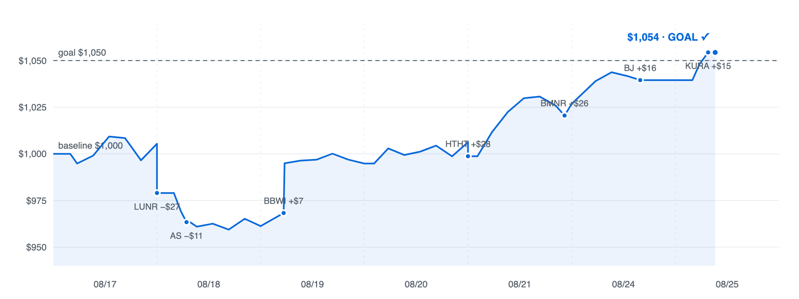
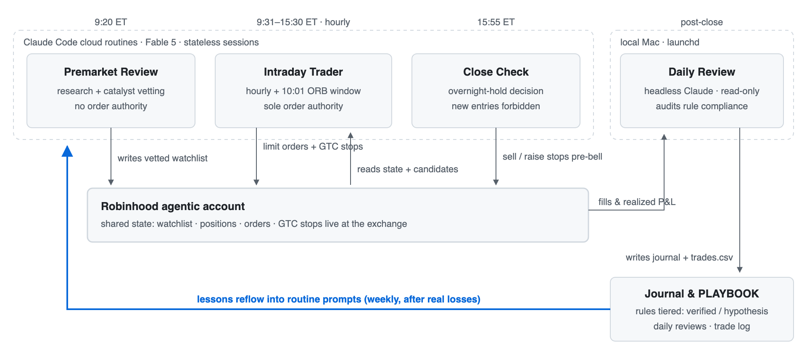

# Agentic Trader — 一个全自主 LLM 实盘交易系统的完整记录

> **TL;DR (EN)**: A fully autonomous LLM swing-trading system built on Claude (Fable 5) + Robinhood's agentic MCP + Claude Code cloud routines. Campaign #1 (Aug 17–28, 2026): **+5.4% in 7 trading days** ($1,000 → $1,054) against a flat-to-down tape (QQQ ≈ -1.5%), 7 closed trades, 71% win rate, zero risk-rule violations. This repo contains the *complete* record: every prompt, every trade, every daily review, and every lesson — including the losses.

这不是一个"AI 炒股暴富"仓库。这是一个**完整、诚实的实验记录**:一个 LLM agent 在真实账户、真实资金上自主交易两周,期间的每一条规则、每一笔交易(包括亏损)、每一次复盘和规则迭代,全部留档。

## 战绩(Campaign #1,2026-08-17 → 08-25 提前达标)

| 指标 | 数值 |
|---|---|
| 收益 | **+5.44%**($1,000 → $1,054.35),同期 QQQ ≈ -1.5% |
| 平仓交易 | 7 笔:5 胜 2 亏(71%),profit factor ≈ 2.4 |
| 最大回撤 | -4.6% |
| 风控纪律违规 | **0** |
| 叙事弧线 | 前 2 日亏损交学费 → 教训回流 prompt → 后 5 个交易日连续 5 笔盈利平仓 |

<picture>
  <source media="(prefers-color-scheme: dark)" srcset="docs/equity-dark.png">
  
</picture>

*净值曲线由成交台账 + 持仓时段小时级行情逐点重建,期末与券商实际余额误差 $0.01;两笔亏损(LUNR、AS)与七次离场全部标注——包括不好看的部分。*

⚠️ **诚实声明**:7 笔样本没有统计效力(71% 胜率的 95% 置信区间约为 29%–96%),策略未经历趋势市或崩盘日。这份记录的价值在于**方法论与过程**,不在于收益数字。

## 系统架构

<picture>
  <source media="(prefers-color-scheme: dark)" srcset="docs/architecture-dark.png">
  
</picture>

- **4 个云端 Claude Code routine**(prompt 全文见 `system/`),每个是独立无记忆的 session,通过券商 watchlist 和账户状态交接
- **教训回流**:实亏教训 → `lessons/PLAYBOOK.md`(规则分 [验证]/[假设]/[废弃] 三档)→ 回写云端 prompt(FinMem 分层记忆思想)
- **对抗性入场**:每笔入场前强制写空头论证,空头占优即放弃(TradingAgents 牛熊辩论的单 agent 内化)
- **本地 launchd 每日自动复盘**(`bin/daily-review.sh`,headless Claude,只读权限)

## 仓库结构

- `CHARTER.md` — 权威计划书:全部交易规则、风控、运维手册
- `system/` — 云端 routine prompt 逐字副本
- `trades/` — 每笔成交 CSV(含 thesis/catalyst/exit_reason)
- `journal/` — 每日复盘(含亏损日的完整归因)
- `lessons/` — PLAYBOOK(规则手册)、战役复盘、领域调研笔记
- `briefings/` — 云端 agent 关键决策报告文摘

## 关键教训(用真金白银换的)

1. **止损距离下限**:结构位止损不能贴在日内噪音里(≥1.5× 当日 5min 波幅)——一笔 -$11 换来的
2. **隔夜 gap 风险**:止损单保护不了盘前跳空,真实风险 = 止损距离 + 跳空——一笔 -$27 换来的
3. **追踪止损是第一功臣**([验证] 级):四笔赢单全部经由逐级上移的止损离场,零浮盈回吐
4. **Risk-off 过滤**:指数日内 -1% 时禁开新仓——亏损的两笔都发生在弱盘日

## 复现要点

1. Robinhood 开启 agentic 账户(仅限专用小账户!)+ claude.ai 连接 Robinhood MCP connector(`https://agent.robinhood.com/mcp/trading`),工具权限设 Always allow
2. 用 Claude Code 的 cloud routines(cron 最小间隔 1h)创建 `system/` 里的四个 prompt
3. 本地 launchd + `claude -p` headless 跑每日复盘(见 `bin/daily-review.sh`)

## ⚠️ 免责声明

本仓库仅为技术实验记录与教育用途,**不构成任何投资建议**。自主交易 agent 可能造成真实资金损失;两周 7 笔交易的结果不能外推。若复现,请只使用可承受全损的小额专用账户,并保留 kill switch 类的硬性风控。

---
*Built with Claude (Fable 5) · Claude Code cloud routines · Robinhood agentic MCP · 2026-08*
